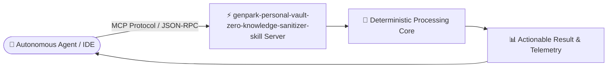

# genpark-personal-vault-zero-knowledge-sanitizer-skill

<div align="center">

[](https://www.python.org/)
[](LICENSE)
[](https://genpark.ai/mcp)
[](https://genpark.ai)
[-brightgreen.svg?style=for-the-badge)](requirements.txt)

<p align="center">
  <b>Production-Grade AI Agent Infrastructure Skill</b> • <b>100% Standard Library Python</b> • <b>Native Model Context Protocol (MCP)</b>
</p>

[🌐 GenPark MCP Hub](https://genpark.ai/mcp) • [📦 GenPark Official](https://genpark.ai) • [📖 Documentation](#quickstart)

</div>

---

## 📌 Overview & Capability

**genpark-personal-vault-zero-knowledge-sanitizer-skill** is a deterministic, high-performance, zero-dependency Python tool and native Model Context Protocol (MCP) server engineered for next-generation personal agents, multi-agent frameworks, and autonomous developer workflows.

> **Executive Capability**: Local-first zero-knowledge personal vault encryptor and PII sanitizer masking credentials, credit cards, and addresses before cloud LLM dispatch with client-side rehydration.

### ⚡ Key Highlights
* 🐍 **Zero External `pip` Dependencies**: Implemented entirely with pure Python standard library for instant zero-overhead execution.
* 🔌 **Native Model Context Protocol (MCP)**: Plugs directly into any MCP-compliant client via JSON-RPC 2.0 stdio.
* ⚡ **Sub-Millisecond Execution**: Slashes token burn and latency by resolving routine agent tasks deterministically without frontier LLM round-trips.
* 🛡️ **Production-Hardened**: Comprehensive error handling, boundary validation, and telemetry.

---

## 🏗️ Architecture



---

## 🚀 Quickstart & Usage

### 1. Direct Python Client Execution
```bash
python example_usage.py
```

### 2. Programmatic Integration
```python
from client import PersonalVaultZeroKnowledgeSanitizer

client = PersonalVaultZeroKnowledgeSanitizer()
result = client.run_privacy_benchmark()
print(result)
```

---

## 🔌 Model Context Protocol (MCP) Setup

Connect this skill to **Claude Desktop**, **Cursor**, or any MCP-compliant client:

### `claude_desktop_config.json`
```json
{
  "mcpServers": {
    "genpark-personal-vault-zero-knowledge-sanitizer-skill": {
      "command": "python",
      "args": ["/path/to/genpark-personal-vault-zero-knowledge-sanitizer-skill/mcp_server.py"]
    }
  }
}
```

### Direct MCP Testing
```bash
python mcp_server.py --test
```

---

## 📊 Technical Specifications

| Parameter | Type | Required | Description |
|---|---|:---:|---|
| `payload` | `string` / `dict` | Yes | Primary context, text, or task input |
| `options` | `dict` | No | Execution flags, thresholds, or sensitivity bounds |

---

<div align="center">
  <sub>Maintained with ❤️ by <b><a href="https://genpark.ai">GenPark AI Engineering</a></b> • Powering Next-Gen Autonomous AI Agents 🌍</sub>
</div>
